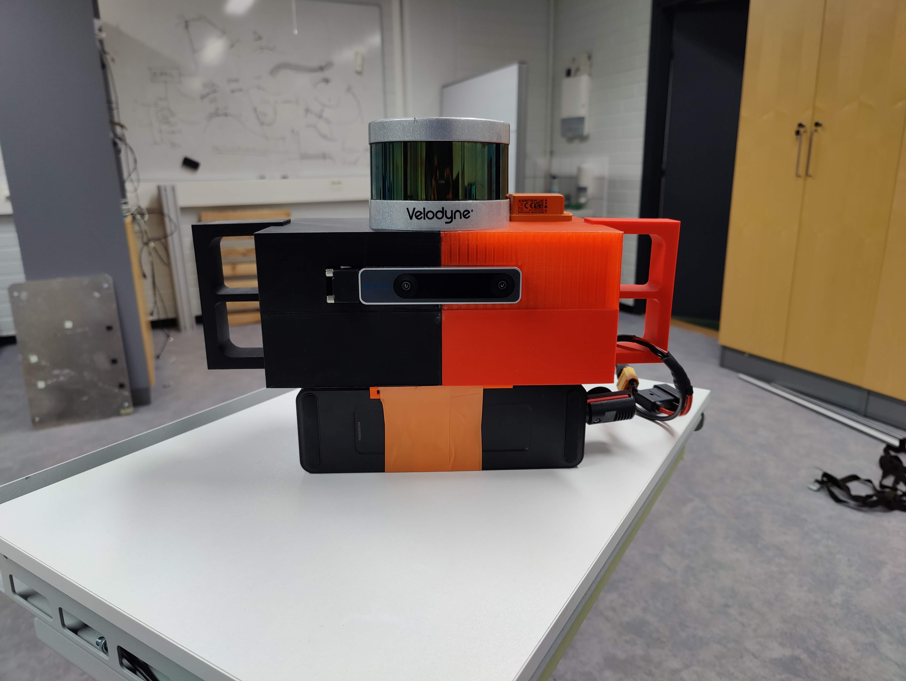

# Repository for sensor-box:

## Sensors included
- Velodyne VLP-16 High-Res - [datasheet](./docs/VLP16_Puck-Hi-Res_Datasheet.pdf)
- Realsense T265 stereo-imu camera - [datasheet](./docs/Realsense_T265.pdf)
- Xsense Mti-300 IMU -  [datasheet](./docs/MTi-300.pdf)

## Connection and collecting data:
- Connect to jetson using ssh, it is configured to connect to the following wireless netowork (SSID: B3, Password: qwert123) this can be changed manually.
- Run the _sensor_launch.sh_ from the directory "something" to start up the sensors, pay attention to the terminal for error messages to make sure that the sensors started properly.
- Run the _record.sh_ file in the same directory to start collection the sensor data into a bag file which will be saved in the same directory.
- Once done press cntrl+c to stop the data collection.  

## Setup models:
- The 3D models of the setup can be found in the [models](./models) folder.
- Solidworks is used for 3D modeling and Inkscape is used for vector graphics design (laser cutting).
- 3D prints and Laser cutting can be done at [FABLAB - Tampere University](https://sites.tuni.fi/fablabtampere-en/).

## Notes:
- VNC can be enabled by running the script _vnc.sh_ at "".  
- Battery is removable and interchangable, the setup uses XT90 power connector.
- Possible improvements for the design include:
- - making sliding slots inside the case to fix Jetson's and cable's position.
 - - including air vent cutouts aligned with jetson's fan placement.
 - - increasing the length of the case to fit the Li-Po battery inside.
